# Домашнее задание к занятию 12.5. «Индексы» - `Елена Махота`

- [Ответ к Заданию 1](#1)
- [Ответ к Заданию 2](#2)
- [Ответ к Заданию 2 - после доработки](#2-1)
- [Ответ к Заданию 2 - после второй доработки](#2-2)
- [Ответ к Заданию 3* - отсутствует](#3)

---

### Задание 1

Напишите запрос к учебной базе данных, который вернёт процентное отношение общего размера всех индексов к общему размеру всех таблиц.

### *<a name = "1"> Ответ к Заданию 1</a>*

```sql
SELECT 
ROUND(((SUM(index_length)) / 1024 / 1024), 2) as 'размер всех индексов, Mb',  
ROUND(((SUM(data_length+index_length)) / 1024 / 1024),2) as 'размер всех таблиц, Mb',
ROUND((SUM(index_length))*100 / (SUM(data_length+index_length)),2) as 'отношение, %'
FROM information_schema.tables
WHERE table_schema = 'sakila' 
```

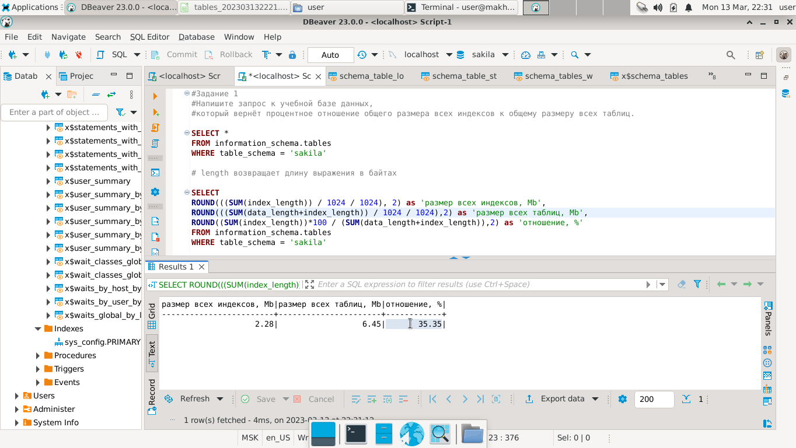

---

### Задание 2

Выполните explain analyze следующего запроса:
```sql
select distinct concat(c.last_name, ' ', c.first_name), sum(p.amount) over (partition by c.customer_id, f.title)
from payment p, rental r, customer c, inventory i, film f
where date(p.payment_date) = '2005-07-30' and p.payment_date = r.rental_date and r.customer_id = c.customer_id and i.inventory_id = r.inventory_id
```
- перечислите узкие места;
- оптимизируйте запрос: внесите корректировки по использованию операторов, при необходимости добавьте индексы.


### *<a name = "2"> Ответ к Заданию 2</a>*

### Изначальный запрос:

```sql
select distinct concat(c.last_name, ' ', c.first_name), sum(p.amount) over (partition by c.customer_id, f.title)
from payment p, rental r, customer c, inventory i, film f
where date(p.payment_date) = '2005-07-30' and p.payment_date = r.rental_date and r.customer_id = c.customer_id and i.inventory_id = r.inventory_id;
```

```bash
EXPLAIN ANALYZE
    -> select distinct concat(c.last_name, ' ', c.first_name), sum(p.amount) over (partition by c.customer_id, f.title)
    -> from payment p, rental r, customer c, inventory i, film f
    -> where date(p.payment_date) = '2005-07-30' and p.payment_date = r.rental_date and r.customer_id = c.customer_id and i.inventory_id = r.inventory_id;
+-------------------------------------------------------------------------------------------------------------------------------------------------------------------------------------------------------------------------------------------------------------------------------------------------------------------------------------------------------------------------------------------------------------------------------------------------------------------------------------------------------------------------------------------------------------------------------------------------------------------------------------------------------------------------------------------------------------------------------------------------------------------------------------------------------------------------------------------------------------------------------------------------------------------------------------------------------------------------------------------------------------------------------------------------------------------------------------------------------------------------------------------------------------------------------------------------------------------------------------------------------------------------------------------------------------------------------------------------------------------------------------------------------------------------------------------------------------------------------------------------------------------------------------------------------------------------------------------------------------------------------------------------------------------------------------------------------------------------------------------------------------------------------------------------------------------------------------------------------------------------------------------------------------------------------------------------------------------------------------------------------------------------------------------------------------------------------------------------------------------------------------------------------------------------------------------------------------------------------------------------------+
| EXPLAIN                                                                                                                                                                                                                                                                                                                                                                                                                                                                                                                                                                                                                                                                                                                                                                                                                                                                                                                                                                                                                                                          |
+-------------------------------------------------------------------------------------------------------------------------------------------------------------------------------------------------------------------------------------------------------------------------------------------------------------------------------------------------------------------------------------------------------------------------------------------------------------------------------------------------------------------------------------------------------------------------------------------------------------------------------------------------------------------------------------------------------------------------------------------------------------------------------------------------------------------------------------------------------------------------------------------------------------------------------------------------------------------------------------------------------------------------------------------------------------------------------------------------------------------------------------------------------------------------------------------------------------------------------------------------------------------------------------------------------------------------------------------------------------------------------------------------------------------------------------------------------------------------------------------------------------------------------------------------------------------------------------------------------------------------------------------------------------------------------------------------------------------------------------------------------------------------------------------------------------------------------------------------------------------------------------------------------------------------------------------------------------------------------------------------------------------------------------------------------------------------------------------------------------------------------------------------------------------------------------------------------------------------------------------------------+
| -> Table scan on <temporary>  (cost=2.50..2.50 rows=0) (actual time=17461.197..17461.284 rows=391 loops=1)
    -> Temporary table with deduplication  (cost=0.00..0.00 rows=0) (actual time=17461.192..17461.192 rows=391 loops=1)
        -> Window aggregate with buffering: sum(payment.amount) OVER (PARTITION BY c.customer_id,f.title )   (actual time=11897.090..17117.097 rows=642000 loops=1)
            -> Sort: c.customer_id, f.title  (actual time=11892.197..11990.249 rows=642000 loops=1)
                -> Stream results  (cost=10074438.46 rows=15587935) (actual time=0.728..2455.734 rows=642000 loops=1)
                    -> Nested loop inner join  (cost=10074438.46 rows=15587935) (actual time=0.721..2099.369 rows=642000 loops=1)
                        -> Nested loop inner join  (cost=8511747.97 rows=15587935) (actual time=0.716..1857.859 rows=642000 loops=1)
                            -> Nested loop inner join  (cost=6949057.48 rows=15587935) (actual time=0.709..1592.726 rows=642000 loops=1)
                                -> Inner hash join (no condition)  (cost=1540183.80 rows=15400000) (actual time=0.693..62.912 rows=634000 loops=1)
                                    -> Filter: (cast(p.payment_date as date) = '2005-07-30')  (cost=1.61 rows=15400) (actual time=0.043..8.993 rows=634 loops=1)
                                        -> Table scan on p  (cost=1.61 rows=15400) (actual time=0.030..6.436 rows=16044 loops=1)
                                    -> Hash
                                        -> Covering index scan on f using idx_title  (cost=112.00 rows=1000) (actual time=0.118..0.479 rows=1000 loops=1)
                                -> Covering index lookup on r using rental_date (rental_date=p.payment_date)  (cost=0.25 rows=1) (actual time=0.002..0.002 rows=1 loops=634000)
                            -> Single-row index lookup on c using PRIMARY (customer_id=r.customer_id)  (cost=0.00 rows=1) (actual time=0.000..0.000 rows=1 loops=642000)
                        -> Single-row covering index lookup on i using PRIMARY (inventory_id=r.inventory_id)  (cost=0.00 rows=1) (actual time=0.000..0.000 rows=1 loops=642000)
 |
+-------------------------------------------------------------------------------------------------------------------------------------------------------------------------------------------------------------------------------------------------------------------------------------------------------------------------------------------------------------------------------------------------------------------------------------------------------------------------------------------------------------------------------------------------------------------------------------------------------------------------------------------------------------------------------------------------------------------------------------------------------------------------------------------------------------------------------------------------------------------------------------------------------------------------------------------------------------------------------------------------------------------------------------------------------------------------------------------------------------------------------------------------------------------------------------------------------------------------------------------------------------------------------------------------------------------------------------------------------------------------------------------------------------------------------------------------------------------------------------------------------------------------------------------------------------------------------------------------------------------------------------------------------------------------------------------------------------------------------------------------------------------------------------------------------------------------------------------------------------------------------------------------------------------------------------------------------------------------------------------------------------------------------------------------------------------------------------------------------------------------------------------------------------------------------------------------------------------------------------------------------+
1 row in set (17.47 sec)


```

### Узкие места в изначальном запросе: 
присоединяет и анализирует множество таблиц, которые не нужны для получения искомого результата, выполняет лишние условия на соответствие id.

*Результат: actual time=17461.197..17461.284 rows=391, 1 row in set (17.47 sec)*

### Оптимизированный запрос:

```sql
select distinct concat(c.last_name, ' ', c.first_name), sum(p.amount)
from customer c
INNER JOIN
  (select customer_id, amount 
   from payment
   where  date(payment_date) = '2005-07-30') p 
ON c.customer_id = p.customer_id
GROUP BY concat(c.last_name, ' ', c.first_name);
```

```bash
EXPLAIN ANALYZE
    -> select distinct concat(c.last_name, ' ', c.first_name), sum(p.amount)
    -> from customer c
    -> INNER JOIN
    ->   (select customer_id, amount 
    ->    from payment
    ->    where  date(payment_date) = '2005-07-30') p 
    -> ON c.customer_id = p.customer_id
    -> GROUP BY concat(c.last_name, ' ', c.first_name);
+---------------------------------------------------------------------------------------------------------------------------------------------------------------------------------------------------------------------------------------------------------------------------------------------------------------------------------------------------------------------------------------------------------------------------------------------------------------------------------------------------------------------------------------------------------------------------------------------------------------------------------------------------------------------------------------------------------------------------------------------------------------------------------------------------------------------------------------------------------------+
| EXPLAIN                                                                                                                                                                                                                                                                                                                                                                                                                                                                                                                                                                                                                                                                                                                                                                                                                                                       |
+---------------------------------------------------------------------------------------------------------------------------------------------------------------------------------------------------------------------------------------------------------------------------------------------------------------------------------------------------------------------------------------------------------------------------------------------------------------------------------------------------------------------------------------------------------------------------------------------------------------------------------------------------------------------------------------------------------------------------------------------------------------------------------------------------------------------------------------------------------------+
| -> Sort with duplicate removal: `concat(c.last_name, ' ', c.first_name)`, `sum(p.amount)`  (actual time=32.025..32.101 rows=391 loops=1)
    -> Table scan on <temporary>  (actual time=31.540..31.644 rows=391 loops=1)
        -> Aggregate using temporary table  (actual time=31.538..31.538 rows=391 loops=1)
            -> Nested loop inner join  (cost=5451.15 rows=15400) (actual time=0.534..29.958 rows=634 loops=1)
                -> Table scan on c  (cost=61.15 rows=599) (actual time=0.251..0.576 rows=599 loops=1)
                -> Filter: (cast(payment.payment_date as date) = '2005-07-30')  (cost=6.43 rows=26) (actual time=0.043..0.049 rows=1 loops=599)
                    -> Index lookup on payment using idx_fk_customer_id (customer_id=c.customer_id)  (cost=6.43 rows=26) (actual time=0.038..0.045 rows=27 loops=599)
 |
+---------------------------------------------------------------------------------------------------------------------------------------------------------------------------------------------------------------------------------------------------------------------------------------------------------------------------------------------------------------------------------------------------------------------------------------------------------------------------------------------------------------------------------------------------------------------------------------------------------------------------------------------------------------------------------------------------------------------------------------------------------------------------------------------------------------------------------------------------------------+
1 row in set (0.04 sec)
```

*Результат: actual time=32.025..32.101 rows=391, 1 row in set (0.04 sec)*


### *<a name = "2-1"> Ответ к Заданию 2 - после доработки</a>*

Запрос доработки: По поводу 2 задания, подумайте, какой еще индекс можно создать, чтобы ускорить запрос (обратите внимание на условие where). Приложите скрин explain analyz вашего преобразованного запроса, где будет видно, что mysql использует созданный вами индекс (возможно, придется переписать само условие where).

**Вариант 1 без индексов**

```sql
select distinct concat(c.last_name, ' ', c.first_name), sum(p.amount)
    from customer c
    INNER JOIN
      (select customer_id, amount 
       from payment
       where  date(payment_date) = '2005-07-30') p 
    ON c.customer_id = p.customer_id
    GROUP BY concat(c.last_name, ' ', c.first_name);
```
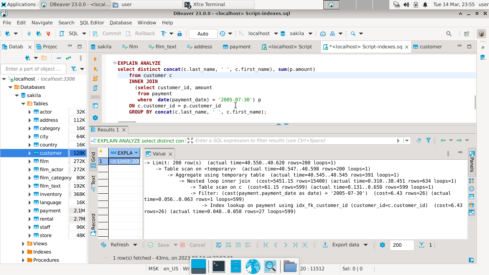


**Вариант 2 без индексов**

```sql
select distinct concat(c.last_name, ' ', c.first_name), sum(p.amount)
    from customer c
    INNER JOIN
      (select customer_id, amount 
       from payment
       where  payment_date like '2005-07-30%') p 
    ON c.customer_id = p.customer_id
    GROUP BY concat(c.last_name, ' ', c.first_name);
```

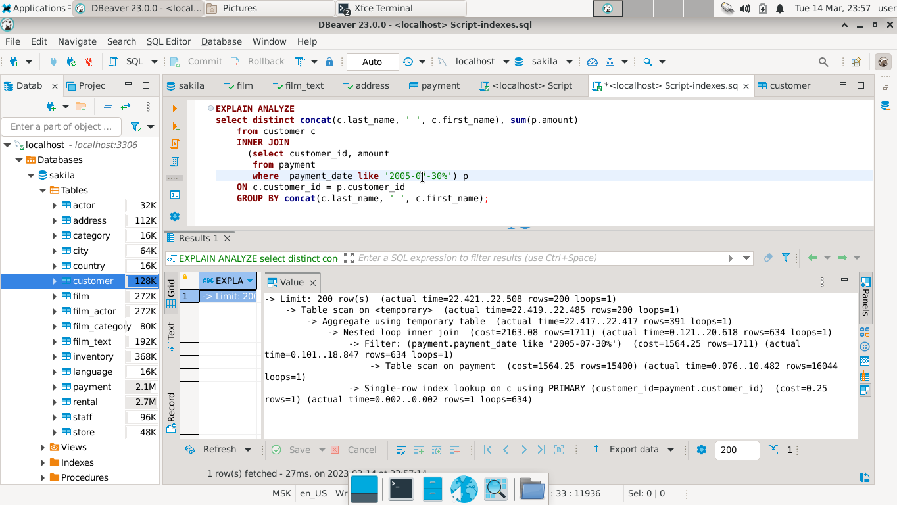


**Вариант 3 без индексов**

```sql
select concat(c.last_name, ' ', c.first_name), sum(p.amount)
from payment p, customer c
where date(p.payment_date) = '2005-07-30' 
and p.customer_id = c.customer_id 
group by concat(c.last_name, ' ', c.first_name);
```

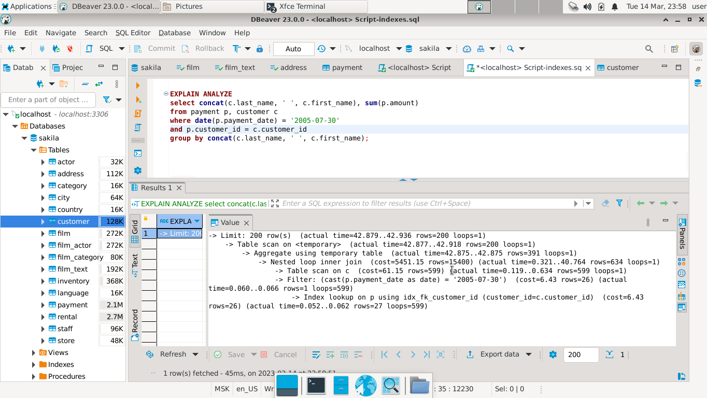


**Вариант 4 без индексов**

```sql
select  concat(c.last_name, ' ', c.first_name) full_name, sum(p.amount)
from payment p, rental r, customer c, inventory i
where date(p.payment_date) = '2005-07-30' 
and p.payment_date = r.rental_date and r.customer_id = c.customer_id and i.inventory_id = r.inventory_id
group by full_name
```

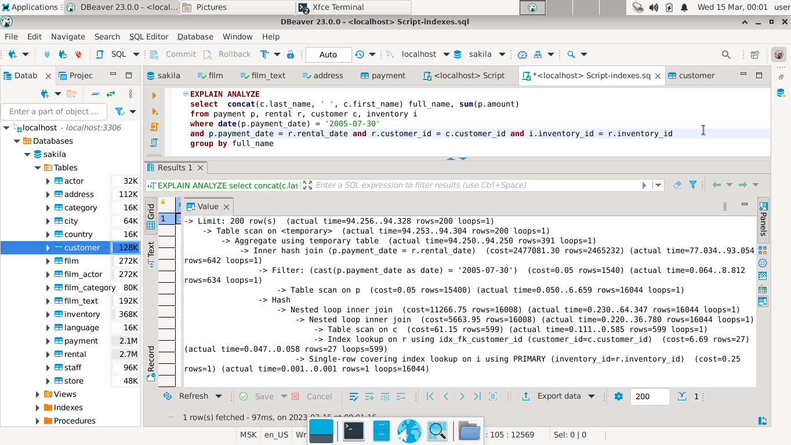

### Добавлены индексы

```sql
CREATE INDEX full_name ON customer (last_name, first_name);

CREATE INDEX payment_date ON payment (customer_id, payment_date);

CREATE INDEX rental_date ON rental (rental_date);
```

**Вариант 1 c индексами**

Из вновь созданных индексов при обработке запроса видно, что mysql использует один индекс `full_name`, запрос обрабатывается немного быстрее.

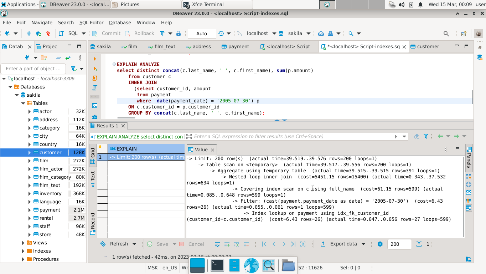


**Вариант 2 c индексами**

При обработке запроса не видно, чтобы mysql использовала новые индексы , результат такой же, как и без них

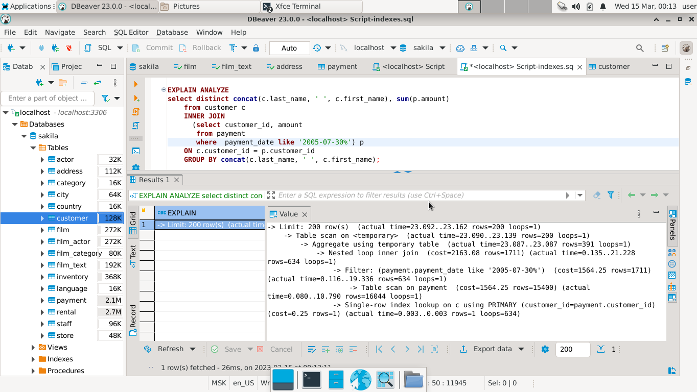

**Вариант 3 c индексами**

Из вновь созданных индексов при обработке запроса видно, что mysql использует  только один индекс `full_name`, запрос обрабатывается немного быстрее.

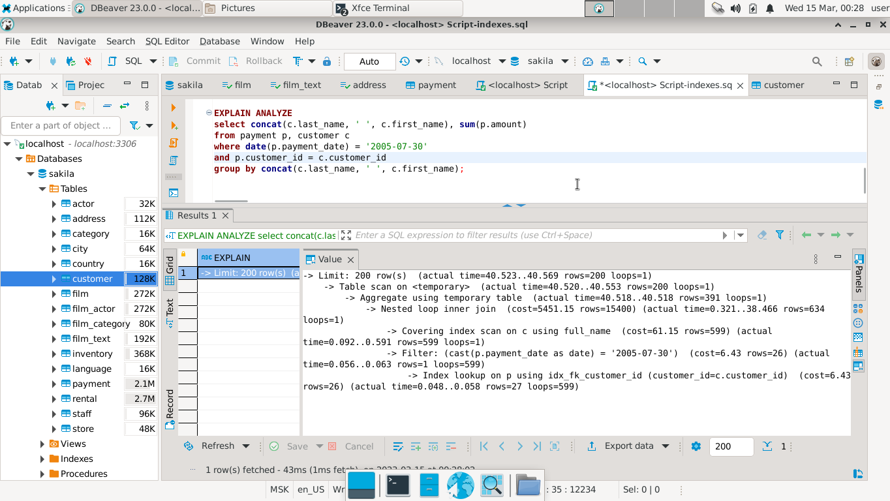


**Вариант 4 c индексами**

Из вновь созданных индексов при обработке запроса видно, что mysql использует  только один индекс `rental_date`, запрос обрабатывается значительно быстрее.

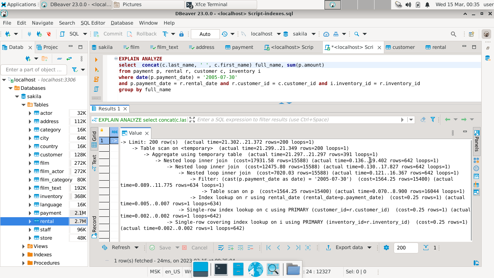


### Выводы:

Быстрее всего из 4-х вариантов ответ на запрос будет получен с помощью варианта 4 при условии применения индексов и с помощью варианта 2 независимо от индексов.

### *<a name = "2-2"> Ответ к Заданию 2 - после второй доработки</a>*


Запрос доработки: Mysql не использует созданный вами индекс для payment_date, так как вы не переписали условие для него. К атрибуту payment_date применен оператор date, поэтому mysql ни в одном из ваших вариантов не использует индекс.
Попробуйте переписать условие следующим образом: p.payment_date >= ‘2005-07-30’ and p.payment_date < DATE_ADD(‘2005-07-30’, INTERVAL 1 DAY) и посмотрите, будет ли использоваться тогда индекс.
Приложите скрин explain analyze для одного из вариантов вашего запроса (который вам больше всего нравится!), где будет видно, что mysql использует созданный индекс.
Также, в данном случае, лучше создать просто индекс CREATE INDEX payment_date ON payment (payment_date) без customer_id.
Жду вашей доработки!
Будут вопросы, пишите в дискорд Ксения Дикова#0524.

Удалила все ранее созданные индексы.

```sql
DROP INDEX payment_date ON payment

DROP INDEX full_name ON customer

DROP INDEX rental_date ON rental
```

Создала индекс `CREATE INDEX payment_date ON payment (payment_date)`

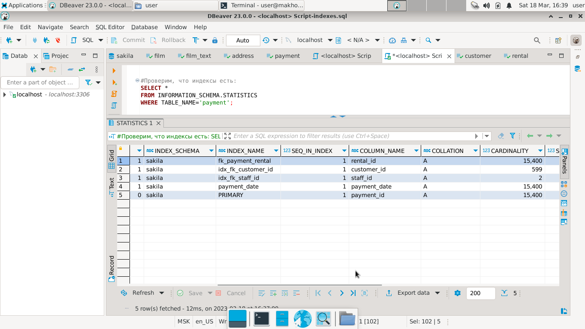

Переписала условие по предложенному варианту

```sql
EXPLAIN ANALYZE
select concat(c.last_name, ' ', c.first_name), sum(p.amount)
from payment p, customer c
where p.payment_date >= "2005-07-30 00:00:00" and p.payment_date < DATE_ADD("2005-07-30 00:00:00", INTERVAL 1 DAY) 
and p.customer_id = c.customer_id 
group by concat(c.last_name, ' ', c.first_name);
```

Время обработки запроса уменьшилось в несколько раз по сравнению с ранее приведенными решениями

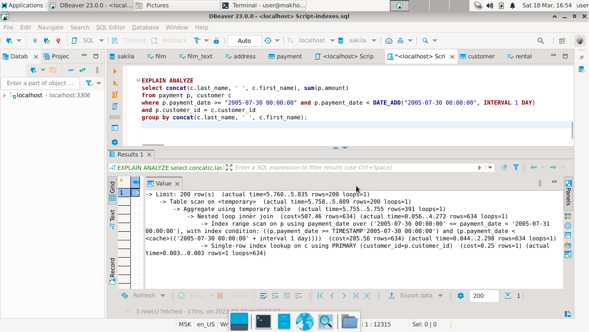


---

## Дополнительные задания (со звёздочкой*)
Эти задания дополнительные, то есть не обязательные к выполнению, и никак не повлияют на получение вами зачёта по этому домашнему заданию. Вы можете их выполнить, если хотите глубже шире разобраться в материале.

### Задание 3*

Самостоятельно изучите, какие типы индексов используются в PostgreSQL. Перечислите те индексы, которые используются в PostgreSQL, а в MySQL — нет.

*Приведите ответ в свободной форме.*

### *<a name = "3"> Ответ к Заданию 3* - отсутствует</a>*
